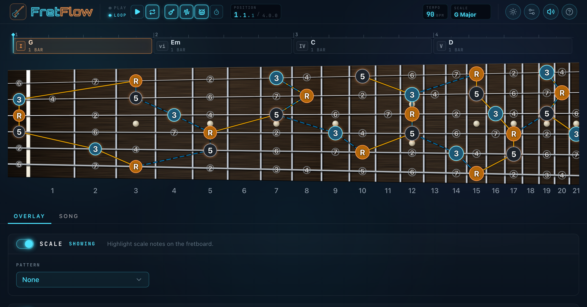

# FretFlow

**[🎸 Live Demo](https://iecg.github.io/fretboard-app/)**

An interactive guitar fretboard learning tool built with React, TypeScript, and Vite.



## Features

### Fretboard Visualization
- **Scale overlay** — highlight any scale across the full fretboard
- **Chord overlay** — visualize any chord independently over any scale (useful for soloing)
- **3-tier note system** — chord tones, scale-only notes, and off-scale chord tones are visually distinct
- **Arpeggio view** — hide scale notes to focus on chord tones only
- **Display modes** — toggle between note names and interval degrees

### Fingering Patterns
- **All notes** — show every scale note on the fretboard
- **CAGED system** — visualize individual or multiple CAGED shapes with color-coded backgrounds
  - Click a shape to isolate it; **Shift+click** to multi-select
  - Shape backgrounds centered on notes with gradient boundaries between adjacent shapes
- **3NPS (3 Notes Per String)** — view individual or all positions

### Circle of Fifths
- Interactive annular segments for root note selection
- Displays key signature, scale degrees, and enharmonic equivalents
- Flats-only notation (except F#/Gb)

### Chord Overlay Controls
- Independent chord root selector (or link to scale root)
- Supports all common chord types
- Non-scale chord tones shown with distinct styling

### Fretboard Controls
- **Fret range** — narrow the visible fret window (e.g. show only frets 5–12); coexists with zoom
- **Zoom** — increase fret column width beyond the auto-fit minimum; at minimum zoom the fretboard fills the full container width
- **Quick-jump** — scroll to Open, Mid (5), or High (12) positions
- **Drag to scroll** — pan the fretboard horizontally
- **Audio playback** — tap any note to hear it

### Settings
- Tuning selector (Standard, Drop D, Open G, and more)
- Display format (notes / intervals)
- Reset button to restore all defaults
- Mute toggle

## Tech Stack

- **React 19** + **TypeScript**
- **Vite** for bundling
- **Lucide React** for icons
- Web Audio API for note synthesis

## Getting Started

```bash
npm install
npm run dev
```

Build for production:

```bash
npm run build
```
