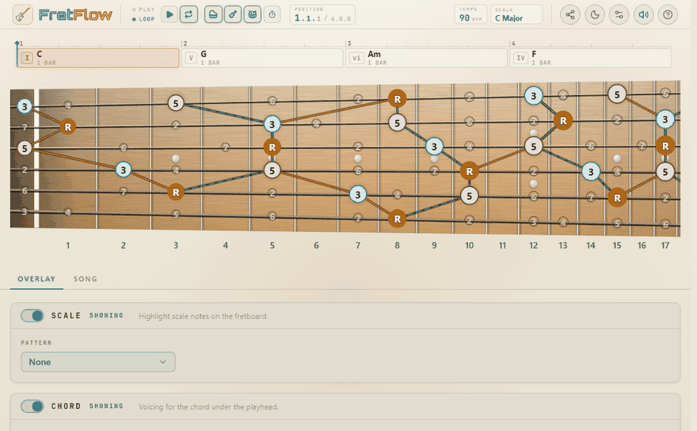

# FretFlow

[](https://iecg.github.io/fretboard-app/)
[](https://github.com/iecg/fretboard-app/tags)
[](https://github.com/iecg/fretboard-app/actions/workflows/ci.yml)
[](https://github.com/iecg/fretboard-app/actions/workflows/deploy.yml)
[](https://nodejs.org/)
[](https://www.typescriptlang.org/)
[](https://react.dev/)
[](https://vitejs.dev/)
[](https://www.gnu.org/licenses/agpl-3.0)
[](https://ko-fi.com/E1E01XFJ0G)

An interactive guitar fretboard for practicing scales, chords, and progressions — with real-time audio, voice-leading cues, and CAGED/3NPS fingering patterns.



## What is FretFlow?

FretFlow is a browser-based practice tool for guitarists who want to see and hear music theory on the fretboard. Load a chord progression, watch voice-leading emphasis flow across notes in real time, and switch between fingering patterns to find comfortable positions. Everything runs in the browser — no install, no account.

## Features

### Fretboard & Scales
- Scale overlay across the full fretboard (all common scales and modes)
- 3-tier note system — chord tones, scale-only notes, and off-scale chord tones are visually distinct
- Arpeggio view — hide scale notes to focus on chord tones only
- Display modes — toggle between note names and interval degrees

### Fingering Patterns
- **All notes** — every scale note on the fretboard
- **CAGED** — visualize individual or multiple CAGED shapes with boundary overlays; click to isolate, Shift+click to multi-select
- **3NPS** — view individual or all three-notes-per-string positions

### Chord Overlay
- Independent chord root selector (or link to the scale root)
- All common chord qualities
- Off-scale chord tones shown with distinct styling

### Progressions & Playback
- Progression presets for common chord sequences
- Chord sequence editor — add, remove, reorder, set duration per chord
- Backing tracks with structural variations and humanized timing
- Transport controls — play, pause, stop
- Tempo and time signature controls

### Practice Tools
- **Improvisation lenses** — Root, Guide Tone, and Common Tone practice modes
- **Guide-tone countdown ring** — beat-tick notches show where you are in the bar
- **Voice-leading emphasis** — anticipation, hold, and departing cues highlight smooth voice motion between chords

### Circle of Fifths
- Interactive annular segments for root note selection
- Key signature, scale degrees, and enharmonic equivalents

### Fretboard Controls
- Fret range — narrow the visible window (e.g. frets 5–12)
- Zoom — increase fret column width beyond auto-fit
- Quick-jump — scroll to Open, Mid (5), or High (12) positions
- Drag to scroll — pan horizontally
- Audio playback — tap any note to hear it

### Settings
- Tuning selector (Standard, Drop D, Open G, and more)
- Display format (notes / intervals)
- Theme (dark / light)
- Mute toggle
- Reset to defaults

## Tech Stack

- **React 19** + **TypeScript**
- **Vite** for bundling
- **Jotai** for state management
- **Tonal.js** for music theory
- **Tone.js** for progression audio
- **Web Audio API** for note synthesis
- **Lucide React** for icons

## Getting Started

```bash
pnpm install
pnpm run dev
```

Build for production:

```bash
pnpm run build
```

## Support

If you find FretFlow useful, consider supporting its development:

[](https://ko-fi.com/E1E01XFJ0G)
